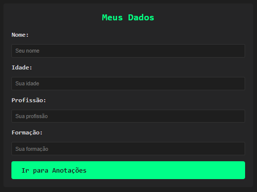

# Meu Diário Digital

> Um diário digital para organizar suas notas, anotações e registros do dia a dia de forma simples e prática.

---

## Descrição

Este projeto foi desenvolvido para ajudar na organização pessoal, permitindo criar, visualizar e gerenciar anotações rapidamente. Possui interface intuitiva e funcionalidades essenciais para um diário digital.

---

## Tecnologias Utilizadas

- HTML
- CSS
- JavaScript
- GitHub Pages (para hospedagem, se aplicável)

---

## Prints do Projeto

### Tela Inicial


### Notas


### Anotações


---

## Funcionalidades

- Adicionar novas notas e anotações
- Editar e remover entradas existentes
- Organização das informações de forma clara e intuitiva

---

## Como Executar

1. Clone este repositório:
```bash
git clone https://github.com/seu-usuario/meu-diario-digital.git